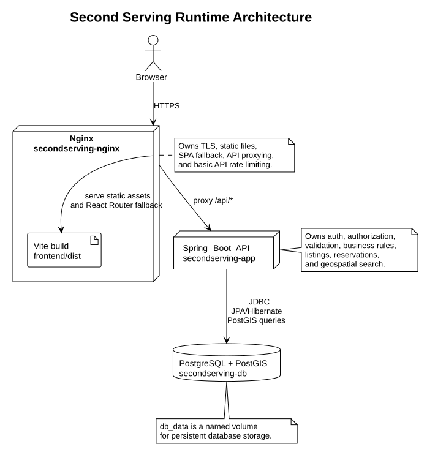

# Architecture

Second Serving is a geo-based food sharing web app. It connects people who have
surplus food with nearby people who can use it, with location-based discovery at
the center of the product.

This document is the high-level system map. It explains how the major parts fit
together and points to the deeper docs for product behavior, API contracts,
frontend structure, database design, and deployment operations.

## System Overview

The application has four main runtime components:

- **Frontend:** React, TypeScript, Vite, Mantine, TanStack Query, Zustand, React
  Router, Zod, and MapLibre.
- **Backend:** Spring Boot REST API with Spring Security, JPA/Hibernate,
  Flyway, OpenAPI, JWT cookies, and geospatial support.
- **Database:** PostgreSQL with PostGIS for relational data and proximity
  queries.
- **Edge server:** Nginx for TLS, static frontend assets, SPA fallback, API
  proxying, and basic API rate limiting.

## Runtime Architecture

Production traffic flows through Nginx. Static browser assets are served from
the Vite build output, while API requests are proxied to the Spring Boot app.



Local development uses a different shape:

- Vite serves the frontend development app.
- Spring Boot runs the API.
- Docker Compose runs PostgreSQL/PostGIS.
- Vite proxies `/api` requests to the local Spring Boot server.

Production uses Docker Compose:

- Nginx serves `frontend/dist`.
- Nginx proxies `/api/*` to the `app` service.
- The `app` service connects to the `db` service over the Compose network.

## Application Boundaries

The frontend owns browser concerns: UI, routing, forms, client-side validation,
API calls, map rendering, and a local mirror of auth state.

The backend owns server concerns: authentication, authorization, request
validation, business rules, listing workflows, reservation workflows, and
geospatial search.

The database owns persistence concerns: relational integrity, durable storage,
geospatial data, geospatial indexes, and Flyway schema history.

Nginx owns edge concerns: HTTPS termination, static asset serving, React Router
fallbacks, reverse proxying to the API, and basic rate limiting for `/api/*`.

## Backend Architecture

The backend is a layered Spring Boot application:

- **Controllers** expose REST endpoints under `/api`.
- **DTOs** define request and response shapes at the API boundary.
- **Services** enforce business rules and coordinate workflows.
- **Repositories** handle persistence through Spring Data JPA.
- **Domain entities** map application concepts to database tables.

Authentication uses Spring Security. Login and signup issue a JWT in an
HttpOnly cookie, so browser JavaScript does not need to read or store the raw
token. Authenticated requests are resolved through the Spring Security
principal.

OpenAPI is generated from controller and DTO definitions. The frontend consumes
generated TypeScript types from that OpenAPI document, so API shape changes
should flow through the backend contract instead of hand-maintained frontend
types.

## Frontend Architecture

The frontend is organized by app infrastructure, API helpers, features, shared
components, and local stores:

```txt
src/app/          providers, router, query client
src/api/          fetch helper, generated OpenAPI types, query keys
src/config/       routes, environment, map defaults
src/features/     auth, listings, reservations, map feature code
src/shared/       reusable components and utilities
src/stores/       Zustand client state
```

TanStack Query owns server state. Zustand is reserved for local client state,
such as the current map center/radius and the synchronous mirror of the
authenticated user. Feature modules own their pages, API functions, hooks, and
validation schemas.

## Data Model And Core Flows

The core domain is built around four entities:

- **User:** a registered account.
- **FoodListing:** a surplus food post owned by a user.
- **PickupLocation:** the address, coordinates, pickup window, and instructions
  for a listing. Each listing currently has one pickup location.
- **Reservation:** a request by a user to reserve some quantity from a listing.

Core request flows:

- Signup and login set the JWT auth cookie and return safe session metadata.
- The frontend calls `/api/users/me` to rebuild authenticated user state.
- Authenticated users create listings with one pickup location.
- Nearby listing search uses PostGIS distance filtering and sorting.
- Users create, update, and delete their own reservations.
- Listing owners update or delete their own listings.

## Deployment Architecture

Production deployment is managed with Docker Compose:

- **`db`:** PostgreSQL/PostGIS database.
- **`app`:** Spring Boot API container built from `backend/`.
- **`nginx`:** Nginx container that serves the frontend and proxies API traffic.

The `db_data` named volume stores persistent PostgreSQL data. The
`frontend/dist` directory is bind-mounted into Nginx so each frontend build is
served as static files. TLS certificates are mounted from `certs/`.

See [Deployment](docs/deploy.md) for the deployment script and operational
commands.

## Architectural Decisions

- Use REST and OpenAPI-generated frontend types instead of manually maintained
  TypeScript API contracts.
- Store the JWT in an HttpOnly cookie instead of localStorage.
- Use PostgreSQL/PostGIS because proximity search is a core product capability.
- Manage schema changes with Flyway and keep Hibernate in validation mode with
  `ddl-auto=validate`.
- Build production frontend configuration from root `.env.prod`, because Vite
  embeds production environment values into the generated bundle.
- Keep map tile hosting as a future deployment concern unless it is explicitly
  wired into Compose.

## Further Reading

- [Product](docs/product.md)
- [Frontend](docs/frontend.md)
- [API](docs/api.md)
- [Database](docs/database.md)
- [Deployment](docs/deploy.md)
