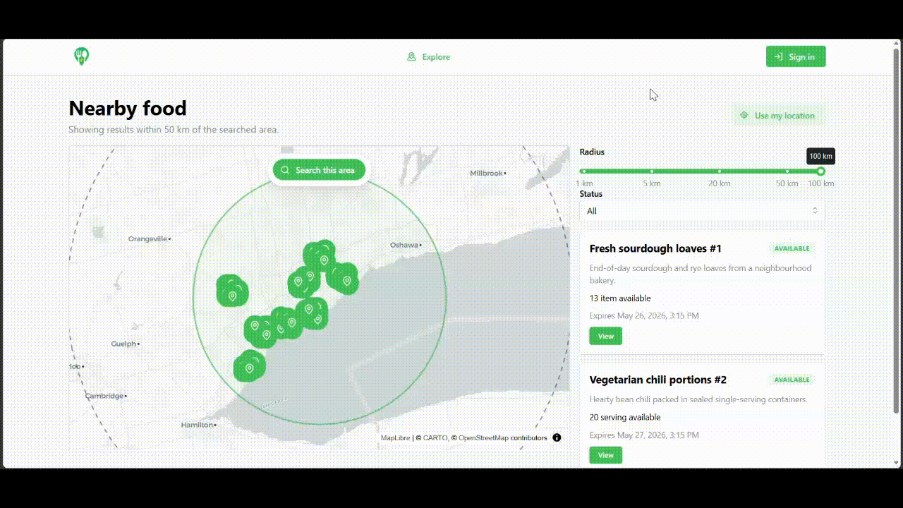

# Second Serving

<p align="center">
  
</p>

<p align="center">
  A location-based food sharing platform for getting surplus food to nearby
  people who can use it.
</p>

<p align="center">
  <a href="https://secondserving.ca/">Live project</a>
</p>

Second Serving helps reduce local food waste by making surplus food easy to
post, discover, and reserve. People with extra food can create a listing with a
pickup location, and nearby users can search by radius, view details, and make a
reservation. The project is built around geospatial discovery, simple workflows,
and a deployment path that can run cleanly on a Linux VPS.

## Demo



## MVP Features

- User signup, login, logout, and authenticated session restore.
- Nearby listing discovery backed by PostGIS distance queries.
- Food listing creation, editing, deletion, and owner management.
- Reservation creation, updates, cancellation, and requester views.
- Owner views for reservations on their listings.
- Docker-based local database and production deployment support.

## Tech Stack

**Frontend**

- React
- TypeScript
- Vite
- Mantine
- TanStack Query
- Zustand
- React Router
- Zod
- MapLibre

**Backend**

- Java 17
- Spring Boot
- Spring Security
- Spring Data JPA / Hibernate
- Flyway
- OpenAPI / springdoc-openapi

**Data and infrastructure**

- PostgreSQL
- PostGIS
- Docker Compose
- Nginx

## Development Requirements

Development is expected to run on a Linux system.

Install:

- Git
- Java 17
- Node.js and npm
- Docker with the Docker Compose plugin
- Bash
- `setsid`, usually provided by `util-linux`

## Local Development

Clone the repo and start the development environment:

```bash
git clone git@github.com:NadifRahman/second_serving.git
cd second_serving
scripts/dev.sh
```

Then open:

- Frontend: `http://localhost:5173`
- Backend: `http://localhost:8080`

The dev script starts PostgreSQL/PostGIS through Docker Compose, waits briefly
for the database, starts the Spring Boot API with `backend/mvnw`, and starts the
Vite frontend. Press `Ctrl-C` to stop the frontend, backend, and Compose
database service started by the script.

Development configuration lives in `.env.dev`. Frontend variables are read by
Vite from the repo root.

## Useful Commands

```bash
# Start the full local development environment
scripts/dev.sh

# Regenerate frontend TypeScript API types from the live backend OpenAPI schema
scripts/generate-api-types.sh

# Build the production frontend bundle
npm --prefix frontend run build

# Lint the frontend
npm --prefix frontend run lint

# Run backend tests
cd backend && ./mvnw test
```

## Documentation

- [Architecture](ARCHITECTURE.md)
- [Product](docs/product.md)
- [Frontend](docs/frontend.md)
- [API](docs/api.md)
- [Database](docs/database.md)
- [Deployment](docs/deploy.md)
- [Testing](docs/testing.md)
- [Resources](docs/resources.md)
