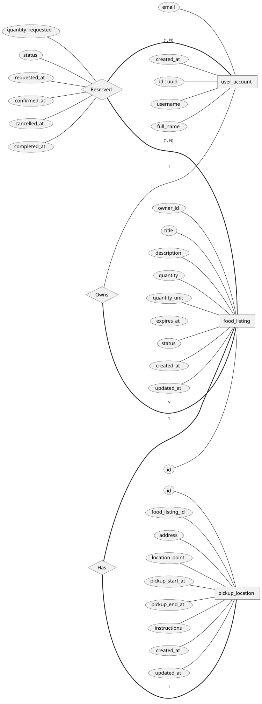

# Database

## Overview

This application uses PostgreSQL with the PostGIS extension for geospatial data
support. Schema changes are managed through Flyway migrations and applied automatically at application startup.

The database is responsible for storing:

- User accounts
- Food listings posted by users
- Pickup locations associated with listings
- Reservation requests made by users for listings
- Listing lifecycle status (available, finished, cancelled)
- Reservation lifecycle status (requested, cancelled, collected)
- Geospatial coordinates used for proximity search
- Audit timestamps for major entities

All schema changes must go through Flyway migrations. No manual production
schema edits are allowed.

---

## Stack & Versions

- PostgreSQL: 16.x
- PostGIS: 3.x
- Flyway: Managed via Spring Boot
- ORM: Spring Data JPA (Hibernate)
- Local Environment: Docker

Docker image used: found in [the docker compose YAML](../docker-compose.yml)

Default local DB config: found in [the docker compose YAML](../docker-compose.yml)

---

## High-Level Schema Design

### Core Tables

The database schema is centered around four primary tables:

**user_account**

Stores registered users of the platform.

Fields include:
- id (UUID primary key)
- username
- full_name
- email
- created_at

---

**food_listing**

Represents a surplus food listing created by a user.

Fields include:
- id (primary key)
- owner_id (foreign key → user_account)
- title
- description
- quantity
- quantity_unit (enum)
- expires_at
- status (enum)
- created_at
- updated_at

---

**pickup_location**

Stores the location and pickup window for a listing.

Each listing has exactly one pickup location. This could change in the future.

Fields include:
- id
- food_listing_id (foreign key → food_listing)
- address
- location_point (PostGIS geography)
- pickup_start_at
- pickup_end_at
- instructions
- created_at
- updated_at

---

**reservation**

Represents a request from a user to claim a listing.

Multiple reservations may exist for a listing, but only one may be
successfully completed.

Fields include:
- listing_id (foreign key → food_listing)
- requester_id (foreign key → user_account)
- quantity_requested
- status (enum)
- requested_at
- confirmed_at
- cancelled_at
- completed_at

## ER Diagram


---

## Geospatial Strategy

Location data is stored using the PostGIS `GEOGRAPHY(Point, 4326)` type.

Each pickup location stores a latitude/longitude coordinate in the
`location_point` column.

This enables efficient spatial queries such as:

- Finding listings within a given radius
- Sorting listings by distance
- Filtering by proximity

Typical query pattern:

1. Filter listings within a radius using `ST_DWithin`
2. Sort results using `ST_Distance`
3. Exclude expired or completed listings

A spatial GiST index will be created on the location column to support
efficient geospatial searches.
---

## Migration Strategy (Flyway)

All schema changes must be created as Flyway migration files. These `.sql` files are stored under `backend/src/main/resources/db/migration`. 

Naming convention (as an example):

V1__init.sql  
V2__add_claim_table.sql  
V3__add_listing_index.sql

Rules:

- Migrations are immutable once committed.
- Never edit old migrations after they have been applied.
- New changes require a new migration file.
- `flyway_schema_history` table is managed automatically by Flyway.

During early development only, the database may be dropped and recreated
to allow iteration on V1.

---

## Local Development Setup

Start database:

docker compose up

Reset database (development only):

Option 1:
- Drop and recreate the entire database.
```sql
DROP DATABASE secondserving;
CREATE DATABASE secondserving;
```

Option 2:
- Enable Flyway clean (dev only) and run clean + migrate.

Connect via psql:
```shell
docker exec -it secondserving-db psql -U secondserving
```

---

## Indexing Strategy

[TODO]

---

## Operational Notes

[TODO]

---

## Enums

food_listing.status
- available
- finished
- cancelled

reservation.status
- requested
- cancelled
- collected

food_listing.quantity_unit
- item
- serving
- gram
- kilogram
- milliliter
- liter
- dozen
- package

## 10. Future Improvements
